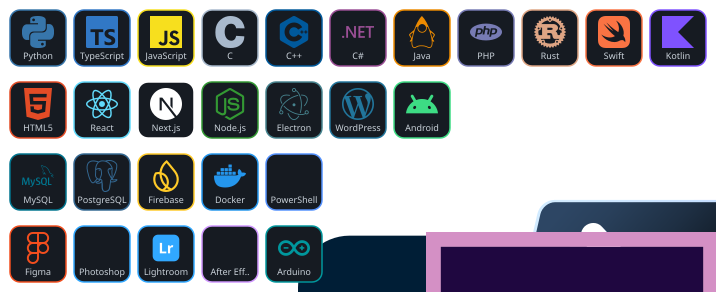
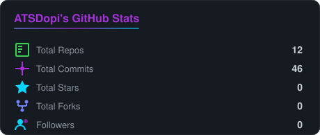
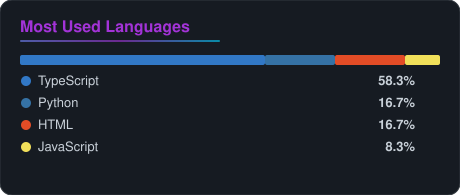
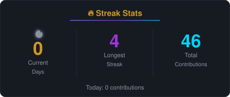
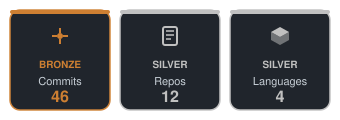
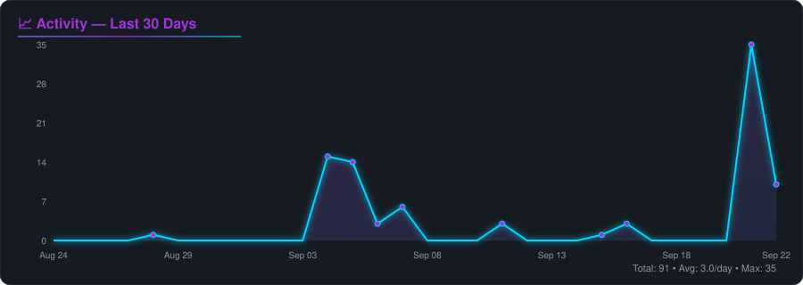
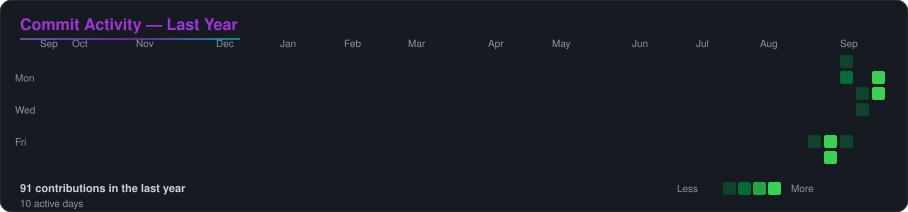
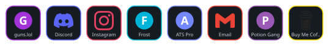

<div align="center">
  
</div>

<br/>

<div align="center">
  
</div>

<br/>

<div align="center">
  
</div>

<br/>

---

### 👋 About Me

```python
class ATSDopi:
    def __init__(self):
        self.name = "ATS-Dopi"
        self.role = "Cybersecurity Student"
        self.current_project = "CTF Toolbox"
        self.languages = ["Python", "TypeScript", "JavaScript", "C", "C++",
                          "C#", "Java", "PHP", "Rust", "Swift", "Kotlin"]
        self.web = ["HTML5", "React", "Next.js", "Node.js", "Electron",
                    "WordPress", "Android"]
        self.databases = ["MySQL", "PostgreSQL", "Firebase"]
        self.tools = ["Docker", "PowerShell", "Figma", "Photoshop",
                       "Lightroom", "After Effects", "Arduino"]
        self.interests = ["CTF", "OSINT", "Pentest", "Reverse Engineering",
                          "LLM", "Automation"]
        self.location = "France"
        self.hub = "https://guns.lol/atsdopi"
```

- 🎓 **Cybersecurity Student** based in France
- 🔨 Currently building a **CTF Toolbox** — a collection of tools for Capture The Flag competitions
- 🌱 Always learning: **Offensive Security**, **Reverse Engineering** & **LLM Agents**
- 💬 Ask me about **Python, TypeScript, Backend architecture, CTF challenges**
- ⚡ Fun fact: *I turn coffee into commits, and commits into trophies 🏆*

---

### 🛠️ Tech Stack

<div align="center">
  
</div>

<br/>

---

### 📊 GitHub Stats

<div align="center">
  
  
</div>

<br/>

<div align="center">
  
</div>

<br/>

---

### 🏆 Trophies

<div align="center">
  
</div>

<br/>

---

### 📈 Activity Graph

<div align="center">
  
</div>

<br/>

---

### 🐍 Snake — Contribution Animation

<div align="center">
  
</div>

<br/>

---

### 📂 Featured Projects

<div align="center">

| Project | Language | Description |
| --- | --- | --- |
| 🤖 [**LLMify**](https://github.com/ATSDopi/LLMify) | HTML | LLM-powered tool |
| 📸 [**CodeShot**](https://github.com/ATSDopi/CodeShot) | HTML | Styled code screenshots |
| 🔎 [**HeadSeaker**](https://github.com/ATSDopi/HeadSeaker) | Python | Search / security tool |
| 📑 [**markdown-to-slides**](https://github.com/ATSDopi/markdown-to-slides) | TypeScript | MD → presentations |
| 🐺 [**uptime-wolf**](https://github.com/ATSDopi/uptime-wolf) | TypeScript | Uptime monitoring |

</div>

<br/>

---

### 🔗 Find Me Everywhere

> 🌐 **Central hub**: [guns.lol/atsdopi](https://guns.lol/atsdopi) — all my links in one place

<div align="center">
  
</div>

<br/>

<div align="center">

| Platform | Link |
| --- | --- |
| 🌐 **guns.lol** (hub) | [guns.lol/atsdopi](https://guns.lol/atsdopi) |
| 💬 **Discord** | [discord.com/users/704717426729943070](https://discord.com/users/704717426729943070) |
| 📸 **Instagram** | [instagram.com/0._ats_.0](https://instagram.com/0._ats_.0) |
| ❄️ **Frost App** | [frostapp.net](https://www.frostapp.net/) |
| 🚀 **ATS Pro** | [atspro.fr](https://www.atspro.fr/) |
| 🧪 **Potion Gang** | [potiongang.fr](https://www.potiongang.fr/) |
| ✉️ **Email** | [atsprofessional67@gmail.com](mailto:atsprofessional67@gmail.com) |
| ☕ **Buy Me a Coffee** | [buymeacoffee.com/ats_dopi](https://buymeacoffee.com/ats_dopi) |

</div>

<br/>

---

<div align="center">
  
</div>

---

<details>
<summary>🔧 How this profile works</summary>

All SVG assets in this profile are **100% self-generated** — no external services used.

The `tools/` directory contains Python scripts that:
1. Fetch real data from the GitHub API (REST + GraphQL)
2. Generate animated SVG cards with SMIL animations
3. Are run automatically by a GitHub Action (`.github/workflows/generate-assets.yml`) every day

To regenerate manually:
```bash
pip install -r tools/requirements.txt
python tools/generate_all.py ATSDopi
```

</details>
